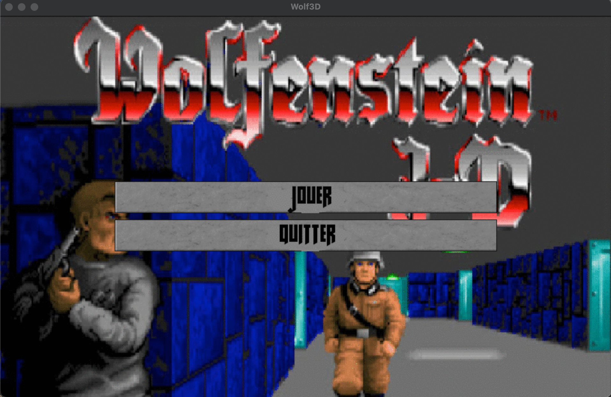
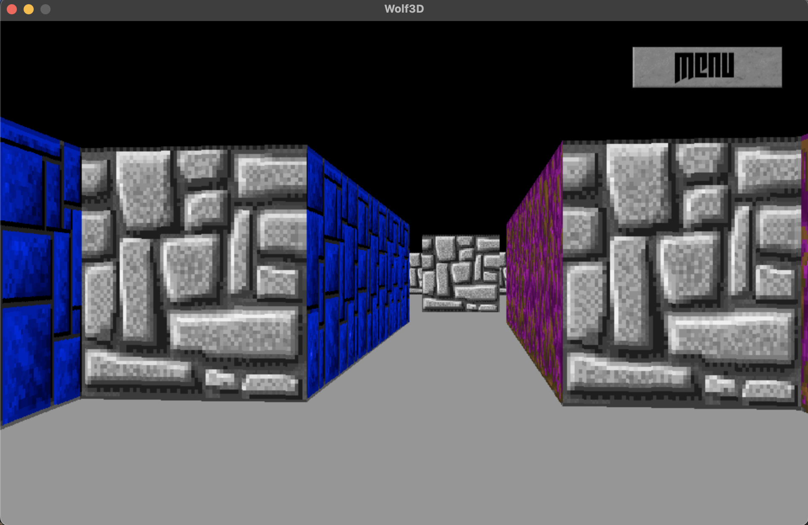

# Wolf3D

wolf3d is a C implementation of a raycasting algorithm, with added texture and movements. It is part of the graphic branch in 42.

## Use

Run make and then wolf3d. You can move with the arrows and quit with escape.

